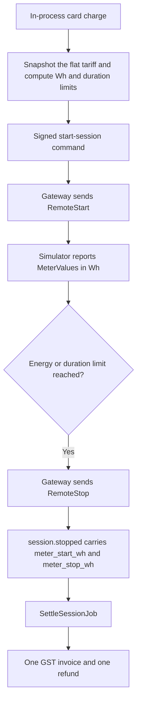
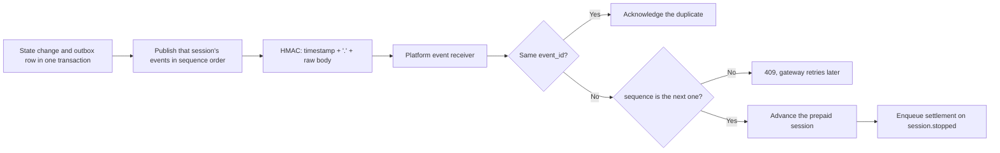

# EV Charging Platform

A small, working slice of an EV charging backend, built as a portfolio project. A Go gateway talks OCPP 1.6J to a fleet of simulated chargers. A Rails app takes a prepaid card payment, tells the gateway when to stop, and then writes a GST invoice and a refund from the meter readings.

I wanted to get the hard parts right rather than the wide parts: live sessions on long-lived sockets, a signed contract between two services, and money that survives retries. Everything runs on a laptop. There are no real chargers, no real payment network and no real tax authority.

All you need is Docker.

## Try it

```sh
cp .env.example .env
docker compose up -d --build --wait
```

The first build takes a few minutes. When it returns, ten simulated chargers are connected. Open the live board at http://localhost:3000/admin/live, then in another terminal start a prepaid session on every charger:

```sh
./scripts/demo-fleet.sh
```

Ten sessions run at once, at different power levels and with different prepaid amounts (₹60 to ₹150), so you'll see ten sets of numbers moving, a fleet power chart climbing, and the sessions finishing one after another over the next few minutes. Each stopped session keeps its final numbers on the board.

Prefer a single charge you can follow end to end? Run:

```sh
./scripts/prepay-session.sh
```

It charges the demo card for a 240 Wh session on `CHG-MUM-0001`, sends the same request again to prove it doesn't create a second session, waits for the charger to deliver 240 Wh, and then checks the receipt: ₹14.32 charged, ₹0.00 refunded. After it stops, the session page links to the receipt.

Stop everything with `docker compose down`. Add `-v` to drop the databases too.

## What's running

| What | Where | Notes |
| --- | --- | --- |
| Live board | http://localhost:3000/admin/live | One card per charger, plus a fleet power chart. Updates every second. |
| Live stream | http://localhost:3000/admin/live/stream | The same board as server-sent events, if you want to watch the wire. |
| Sessions | http://localhost:3000/admin/sessions | Every prepaid session, with a detail page for payment, invoice, refund and gateway events. |
| Receipt | http://localhost:3000/internal/v1/prepaid-sessions/{id}/invoice | HTML invoice, available once a session has settled. |
| Platform health | http://localhost:3000/health | |
| Gateway health | http://localhost:8080/health | |
| Charger status | http://localhost:8080/internal/v1/chargers/CHG-MUM-0001 | Connection and connector state straight from the gateway. |
| Simulator health | http://localhost:8081/health | Healthy once all ten chargers have booted. |

Chargers connect to `ws://localhost:9000/{charger_id}` with HTTP Basic auth. The ten demo chargers are `CHG-MUM-0001` to `CHG-MUM-0010`, all with the password `demo-password`. If you change a port in `.env`, change the URL to match.

## How it fits together

An EV charging backend does two jobs that fail in different ways. Chargers keep a WebSocket open and stream boot, heartbeat, start, meter and stop messages, and that state is only true right now. Billing has to charge a card exactly once, shrug off a repeated request, and produce one invoice whose numbers add up. So the two jobs live in separate services and talk over a small signed HTTP contract.


There are two Postgres databases and the services never share tables. Redis is only the Sidekiq queue.

The split is written up in [ADR 001](docs/adr/001-ownership-split.md). In short:

- The **gateway** owns anything about the device: connections, connector status, the OCPP transaction, meter readings, and enforcing the energy and duration limits it was given.
- The **platform** owns anything about money: drivers, chargers, the tariff, the card charge, prepaid session state, GST, invoices and refunds.
- The gateway never works out a price, and the platform never speaks OCPP.

### From a card payment to an invoice



The seeded tariff is ₹18 per kWh plus a ₹10 session fee, both including GST. Money is always stored as integer paise (1800 and 1000), never as floats, and only turned into rupees when it's displayed.

The demo charge is ₹14.32 (1432 paise), which buys exactly 240 Wh:

```
(1432 - 1000) * 1000 / 1800 = 240
```

When the charger stops at 240 Wh, the energy costs 432 paise, the invoice total is 1432 and the refund is 0. Prepay more than the session uses and the difference comes back as a refund. On every settled session, `prepaid = invoice total + refund`.

GST defaults to 18% (`GST_RATE_PERCENT`) and is snapshotted onto each invoice. Tax is intra-state only, split into CGST and SGST, with any odd paisa going to CGST. This is a simulation, not tax advice.

The invoice is priced once, from `meter_start_wh` and `meter_stop_wh` on `session.stopped`. Meter readings are never summed up to make a price.

### How gateway events are delivered



Delivery is at-least-once, so everything is idempotent. Commands are keyed on `command_id` and events on `event_id`. A later sequence number is refused with a `409 sequence_gap` until the missing earlier one arrives, and the gateway keeps retrying. That's fine when the earlier event is just late. If the two databases get out of step, though (say you reset one volume and not the other), the gateway will keep retrying events for sessions the platform has never heard of, and you'll see a steady stream of `sequence_gap` errors in its log. `docker compose down -v` clears both databases.

Both sides sign requests with HMAC and send `X-Timestamp` and `X-Signature`; a signature has to land within a five-minute window. The platform signs commands with `PLATFORM_SIGNING_SECRET` and the gateway signs events with `GATEWAY_SIGNING_SECRET`. The JSON schemas for both directions live in [`contracts/`](contracts/README.md).

### The live board

The board is rendered on the server, and the page keeps it fresh through a server-sent events stream. Each second the platform rebuilds the board and pushes it only if it changed, so there's no polling and no flicker.

Each charger card shows the energy delivered, the running amount in rupees, and how far through its limit the session is. The running amount prices the latest meter reading with the session's tariff. That's a display estimate; the real invoice is only written when the session stops.

The fleet power chart needs no extra storage. It's worked out from the meter readings already in the database: the power for a reading is the energy since the previous reading divided by the time between them on the charger's own clock, then summed across chargers in two-second buckets. If the platform wasn't receiving readings for a while (during a restart, say), the chart shows a dip. That reflects what the platform received, not that the chargers stopped.

Every open stream holds a Puma thread, so the number of streams is capped (`LIVE_STREAM_MAX_CONNECTIONS`, default 8) and Compose runs Puma with 16 threads. Past the cap the endpoint returns 503.

## Tuning the demo

These live in `.env` (copy `.env.example` to start):

| Setting | Default | What it does |
| --- | --- | --- |
| `SIM_CHARGER_COUNT` | 10 | How many simulated chargers to run, counting up from `CHARGER_ID`. Every one needs an entry in `CHARGER_AUTH`. |
| `SIM_POWER_W` | 7200 | Power of the first charger. The others run at 50%, 150%, 300% and 75% of it, repeating. |
| `SIM_SECONDS_PER_TICK` | 10 | Each real second advances a charger by this many simulated seconds. At 10, a 7.2 kW charger delivers 20 Wh per second, so ₹100 (5 kWh) takes about four minutes. |
| `LIVE_STREAM_MAX_CONNECTIONS` | 8 | Cap on open live board streams. |
| `GST_RATE_PERCENT` | 18 | Snapshotted onto each invoice. |

If you already have a `.env` from an earlier version, refresh it from `.env.example`. An old `CHARGER_AUTH` that only lists one charger makes the other nine get a 401.

## Other scenarios

These are the checks CI runs against Compose. Each one exits non-zero if the outcome is wrong.

| Script | What it checks |
| --- | --- |
| [`payment-declined.sh`](scripts/payment-declined.sh) | A card ending in `0002` is stored as `declined` with no energy limit, and the same request returns that session. |
| [`event-order.sh`](scripts/event-order.sh) | Sequence 2 is refused, sequence 1 is stored, a replay is a duplicate, then sequence 2 is accepted. |
| [`demo-session.sh energy`](scripts/demo-session.sh) | A gateway limit of 240 Wh stops the charger, and `session.stopped` reaches the platform. |
| [`demo-session.sh duration`](scripts/demo-session.sh) | A 60-second limit stops the charger at 120 Wh. |
| [`reconnect-session.sh`](scripts/reconnect-session.sh) | The socket drops mid-session, the charger boots again, and the energy limit still stops it. |
| [`prepay-session.sh`](scripts/prepay-session.sh) | Card charge, replay, 240 Wh, then an invoice of 1432 paise and a refund of 0. |

`demo-session.sh` talks to the gateway directly, so those sessions appear in the gateway database but don't create a prepaid invoice. `prepay-session.sh` is the one that produces a receipt. It reads exact amounts from a `data-paise` attribute on the receipt, since the visible text is in rupees.

All of these use `CHG-MUM-0001`, so let a running `demo-fleet.sh` finish before you run them.

## Running the tests

Everything runs in containers, and nothing needs Go or Ruby on your machine.

```sh
# Platform: RSpec and RuboCop
docker compose up -d --wait platform-db redis
docker compose run --rm -e RAILS_ENV=test \
  -e DATABASE_URL=postgres://ev:ev@platform-db:5432/ev_platform_test \
  platform bundle exec rspec
docker compose run --rm -e SKIP_DB_PREPARE=1 platform bundle exec rubocop

# Gateway and simulator: the image build runs go test -race
docker build --target build ./gateway
docker build --target build ./simulator
```

Point RSpec at its own database, as above. Run against the development database it will collide with the seeded data.

The gateway's database-backed tests need Postgres and run in CI against the Compose database; see [`.github/workflows/ci.yml`](.github/workflows/ci.yml). CI also builds the Compose stack and runs the scenario scripts. It never needs a charger, a payment provider or a network connection to one.

## Why this stack

- **Go for the gateway and simulator.** A charger is a long-lived socket. One goroutine owns each connection, so that charger's commands and meter updates stay in order.
- **[ocpp-go](https://github.com/lorenzodonini/ocpp-go) 0.19.** Both sides use a library for OCPP framing rather than a hand-rolled WebSocket dialect.
- **chi, slog, pgx and sqlc.** The gateway's HTTP surface is small. The SQL is written by hand and sqlc generates the Go. Logging is the standard library.
- **Rails 8.1.** Card charges, tariffs, invoices and refunds are transactional records with validations, and the admin and receipt are just HTML pages.
- **Sidekiq and Redis.** Settlement runs after `session.stopped` and is retried if it fails, so the request that receives the event doesn't have to finish the invoice.
- **Two Postgres databases.** Device state and money don't share a transaction, so a gateway restart can't roll back an invoice.
- **golang-migrate.** Gateway migrations sit next to the service and run as their own Compose step before it starts.
- **An in-process card charge.** The platform needs an idempotent prepaid payment without a payment network. It keeps only the last four digits, declines any number ending in `0002`, and returns the same session if you repeat an idempotency key.
- **Docker Compose.** A reviewer shouldn't have to install Go, Ruby, Postgres or Redis. `docker compose up` is the supported way to run all of it.

## Repo layout

| Path | What's in it |
| --- | --- |
| [`gateway/`](gateway/README.md) | The OCPP central system: session and command state, limit enforcement, and the transactional outbox. |
| [`platform/`](platform/README.md) | The Rails app: registry, tariff, card charge, prepaid sessions, settlement, admin, live board and receipt. |
| [`simulator/`](simulator/README.md) | Ten virtual chargers in one process. `POST /control/reconnect?charger_id=` drops one socket and boots it again. |
| [`contracts/`](contracts/README.md) | JSON schemas for the commands and events both services share. |
| [`scripts/`](scripts) | The demo and the CI scenarios above. |
| [`docs/adr/`](docs/adr/001-ownership-split.md) | Why device state and money are split. |

There is a single seeded tenant (`00000000-0000-0000-0000-000000000001`). Development Compose seeds it along with the ten Mumbai chargers, a demo driver and the flat tariff. `mock-upi/` is an empty directory kept for later; card charges never leave the platform.

## What's not here

This slice stops once the prepaid path, the signed event path, the admin, the live board and the CI scenarios work. Left out on purpose:

- Any login. The admin pages and the internal API are open, because the POC has one tenant and no users yet.
- A tenant UI and RBAC, time-of-use or idle fees, a charger control panel, a reconciliation queue, notifications and PDF invoices.
- Load testing. The live board is sized for a handful of viewers, not a crowd.
- Official OCPP schema validation, IGST, OCPP 2.0.1 and OCPI roaming.
- Any real payment or GST network.

## How the work is delivered

Changes go in as small pull requests, each saying what changed, why and how. The ground rules are in [`AGENTS.md`](AGENTS.md).
