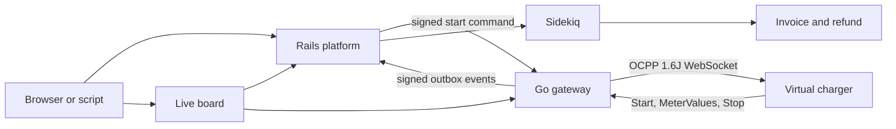
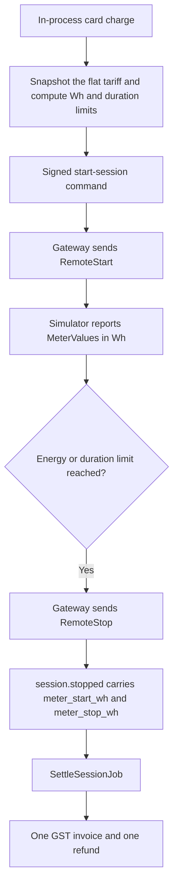
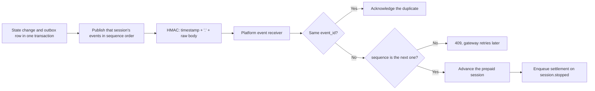

# EV Charging Platform

A portfolio slice of an EV charging stack. A Go gateway speaks OCPP 1.6J to a virtual charger. A Rails platform takes a prepaid card charge, tells the gateway when to stop, and writes a GST invoice and refund from the start and stop meter readings.

The point is the hard part of the system: a live charger session, a signed contract between the two services, and money that stays idempotent. It runs on a laptop. There is no real charger, no real payment network, and no real tax authority.

**Open the [live board](http://127.0.0.1:3000/admin/live), then run [`./scripts/demo-fleet.sh`](scripts/demo-fleet.sh) to start ten prepaid sessions at once. Run [`./scripts/prepay-session.sh`](scripts/prepay-session.sh) for one prepaid charge that stops, invoices, and refunds.**

You only need Docker.

| Surface | URL | What you see |
| --- | --- | --- |
| Live board | http://127.0.0.1:3000/admin/live | One card per charger: kWh delivered, the running rupee amount, and progress towards the session limit. A stopped session keeps its final numbers. Updates every second over server-sent events. |
| Live stream | http://127.0.0.1:3000/admin/live/stream | The same board as `text/event-stream`: one `board` event holding the rendered HTML whenever it changes. At most `LIVE_STREAM_MAX_CONNECTIONS` (8) streams at a time, because each holds a Puma thread. |
| Admin | http://127.0.0.1:3000/admin/sessions | Prepaid sessions, and a session page with payment, invoice, refund, and gateway events. Amounts are in rupees. |
| Receipt | http://127.0.0.1:3000/internal/v1/prepaid-sessions/{id}/invoice | HTML invoice after settlement. |
| Platform health | http://127.0.0.1:3000/health | Rails process is up. |
| Gateway health | http://127.0.0.1:8080/health | Go process is up. |
| Gateway charger | http://127.0.0.1:8080/internal/v1/chargers/CHG-MUM-0001 | Connection and connector status for a charger. The simulator runs `CHG-MUM-0001` to `CHG-MUM-0010`. |
| Simulator health | http://127.0.0.1:8081/health | The virtual charger process is up. |

OCPP connections use `ws://127.0.0.1:9000/{charger_id}` with HTTP Basic auth. The ten demo chargers are `CHG-MUM-0001` to `CHG-MUM-0010`, all with the password `demo-password`.

## Purpose

An EV charging backend has two kinds of work that fail differently.

Chargers hold a WebSocket open and send a stream of boot, heartbeat, start, meter, and stop messages. That state is only true "right now." Billing has to charge a card once, refuse a repeated request, and produce one invoice whose paise add up.

This repository keeps those jobs apart and connects them with a small signed HTTP contract. The gateway stops the charger when a numeric limit is reached. The platform decides the limit from the prepaid amount, and prices the session only when it stops.

## Architecture



Two Postgres databases stay separate. Redis is only the Sidekiq queue. The services do not share tables.

The ownership rule is in [ADR 001](docs/adr/001-ownership-split.md):

- The **gateway** owns connections, connector status, the OCPP transaction, meter readings, and enforcement of `max_energy_wh` and `max_duration_s`.
- The **platform** owns drivers, chargers, the tariff, the card charge, prepaid session state, GST, invoices, and refunds.
- The gateway does not calculate a price. The platform does not speak OCPP.

### How a prepaid charge becomes an invoice



The seeded tariff is **1800 paise per kWh** plus a **1000 paise session fee**. Both numbers are GST-inclusive. The demo charge is **1432 paise**, which buys exactly **240 Wh**:

`(1432 - 1000) * 1000 / 1800 = 240`

At that stop, energy costs 432 paise, the invoice total is 1432, and the refund is 0. A larger prepaid amount leaves a refund of the unused paise. The identity on every settled session is `prepaid = invoice total + refund`.

The live board prices the **latest** meter register with the same formula, so the rupee figure moves during the charge. That number is a display estimate. The stored invoice is computed only from `meter_start_wh` and `meter_stop_wh` on `session.stopped`. Meter batches are never summed to make a price.

GST defaults to 18% (`GST_RATE_PERCENT`) and is snapshotted onto the invoice. Tax is intra-state only: CGST and SGST, with an odd paisa placed on CGST. This is a simulation, not tax advice.

### How a gateway event is delivered



Commands are idempotent on `command_id`. Events are idempotent on `event_id`, and a later sequence is refused until the missing earlier one arrives. Signatures use `X-Timestamp` and `X-Signature`, and must fall inside a five-minute window. The platform signs commands with `PLATFORM_SIGNING_SECRET`. The gateway signs events with `GATEWAY_SIGNING_SECRET`.

Schemas for both directions live in [`contracts/`](contracts/README.md).

## Why these technologies

| Choice | Where it is used | Why |
| --- | --- | --- |
| Go 1.25 | Gateway and simulator | A charger is a long-lived socket. One goroutine owns each connection, so that charger's commands and meter updates stay in order. |
| [ocpp-go](https://github.com/lorenzodonini/ocpp-go) 0.19 | OCPP 1.6J | The gateway and the simulator use a library for the protocol framing instead of a hand-rolled WebSocket dialect. |
| chi, slog, pgx, sqlc | Gateway HTTP, logs, and SQL | The HTTP surface is small. SQL is written by hand and sqlc generates the Go. Structured logs come from the standard library. |
| Rails 8.1 | Platform, admin, live board, receipt | Card charges, tariffs, invoices, and refunds are transactional records with validations and HTML pages. |
| Sidekiq and Redis | `SettleSessionJob` | Settlement runs after `session.stopped`, and Sidekiq retries it. The web request that receives the event does not have to finish the invoice. |
| Postgres, two databases | `ev_gateway` and `ev_platform` | Device state and money do not share a transaction. A gateway restart does not roll back an invoice. |
| golang-migrate | Gateway schema | SQL migrations sit next to the Go service and run as their own Compose step before the gateway starts. |
| Integer paise | Every money column | A rupee amount is `paise / 100` at display time. Prices are never stored as floats. |
| In-process card charge | `POST /internal/v1/prepaid-sessions` | The POC needs an idempotent prepaid payment without a payment network. The platform keeps the last four digits. A number ending in `0002` is declined. Repeating the same idempotency key returns the same session. |
| Docker Compose | Run, demo, and CI | A reviewer does not install Go, Ruby, Postgres, or Redis. `docker compose up` is the supported setup. |

## Run a local demo

```sh
cp .env.example .env
docker compose up -d --build
```

The first build downloads images and compiles the Go and Rails apps. Wait until the demo chargers are connected:

```sh
curl --fail --retry 30 --retry-all-errors --retry-delay 2 --silent --show-error \
  http://127.0.0.1:8080/internal/v1/chargers/CHG-MUM-0001
```

`connection_state` should be `connected`. Then open http://127.0.0.1:3000/admin/live and, in another terminal, start a prepaid session on every charger:

```sh
./scripts/demo-fleet.sh
```

Ten chargers charge at the same time, at different power levels and with different prepaid amounts (₹60 to ₹150), so the board shows ten values moving and the sessions finish one after another over a few minutes. To charge one card and see the receipt, run:

```sh
./scripts/prepay-session.sh
```

The script posts a prepaid session for phone `9876543210` on `CHG-MUM-0001`, posts that same request again, and requires one session id. It waits until the virtual charger has delivered **240 Wh**, then waits until the receipt shows **₹14.32** and a **₹0.00** refund. The receipt keeps the exact integer paise in a `data-paise` attribute, which is what the script checks. The live board updates while that session is charging. After it stops, the session page links to the receipt.

The simulator runs `SIM_CHARGER_COUNT` chargers (default 10) in one process. `CHG-MUM-0001` is a constant **7.2 kW** charger. The others run at 50%, 150%, 300% and 75% of that, repeating. Each wall-clock second stands for **10** simulated seconds (`SIM_SECONDS_PER_TICK`), so a 7.2 kW charger delivers **20 Wh** per second. A 240 Wh charge takes about 12 seconds, and ₹100 buys 5 kWh, which takes about four minutes.

Stop the stack with `docker compose down`. Add `-v` to drop the databases too.

### Other scenarios

These are the checks CI runs against Compose. Each exits non-zero if the outcome is wrong.

| Script | What it checks |
| --- | --- |
| [`scripts/payment-declined.sh`](scripts/payment-declined.sh) | A card ending in `0002` is stored as `declined`, with no energy limit. The same request returns that session. |
| [`scripts/event-order.sh`](scripts/event-order.sh) | Sequence 2 is refused, sequence 1 is stored, a replay is a duplicate, then sequence 2 is accepted. |
| [`scripts/demo-session.sh energy`](scripts/demo-session.sh) | A gateway limit of 240 Wh stops the charger. `session.stopped` reaches the platform. |
| [`scripts/demo-session.sh duration`](scripts/demo-session.sh) | A 60-second limit stops the charger at 120 Wh. |
| [`scripts/reconnect-session.sh`](scripts/reconnect-session.sh) | The socket drops mid-session, the charger boots again, and the energy limit still stops it. |
| [`scripts/prepay-session.sh`](scripts/prepay-session.sh) | Card charge, replay, 240 Wh, invoice 1432, refund 0. |

`demo-session.sh` talks to the gateway directly, so those sessions show up in the gateway database and as delivered events. They do not create a prepaid invoice. The prepaid script is the one that produces a receipt.

## Code map

| Path | Responsibility |
| --- | --- |
| [`gateway/`](gateway/README.md) | OCPP central system, session and command state, limit enforcement, transactional outbox. |
| [`platform/`](platform/README.md) | Registry, tariff, card charge, prepaid sessions, settlement, admin, live board, receipt. |
| [`simulator/`](simulator/README.md) | Ten virtual chargers in one process. `POST /control/reconnect?charger_id=` drops that socket and boots again. |
| [`contracts/`](contracts/README.md) | Command and event JSON schemas shared by both sides. |
| [`scripts/`](scripts) | The demo and the CI scenarios above. |
| [`docs/adr/`](docs/adr/001-ownership-split.md) | Why device state and money are split. |

The POC tenant id is `00000000-0000-0000-0000-000000000001`. Development Compose seeds that tenant, the ten Mumbai chargers, the demo driver, and the flat tariff. `mock-upi/` is an empty reserved directory. Card charges stay inside the platform.

## Limits of this slice

The slice stops once the prepaid path, the signed event path, the admin, the live board, and the CI scenarios work.

Still out of scope: a tenant UI and RBAC, time-of-use or idle fees, a charger control panel, a reconciliation queue, load tests, notifications, PDF invoices, official OCPP schema validation, IGST, and any real payment or GST network. OCPP 2.0.1 and OCPI roaming are out of scope too.

## Development

Work is delivered as [small pull requests](AGENTS.md). Each one says what changed, why, and how.

CI builds the Compose stack and runs the scenario scripts, then runs `go test -race` for the gateway and simulator and RSpec plus RuboCop for the platform. Those jobs use the service images. They do not need a charger, a payment provider, or host-installed Go or Ruby.
